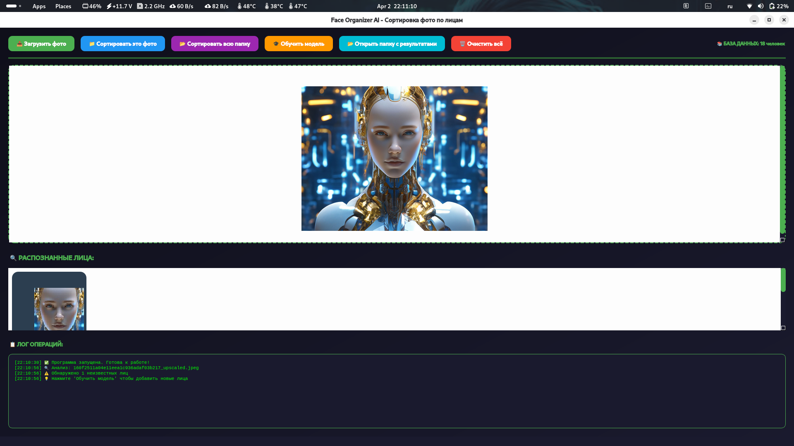
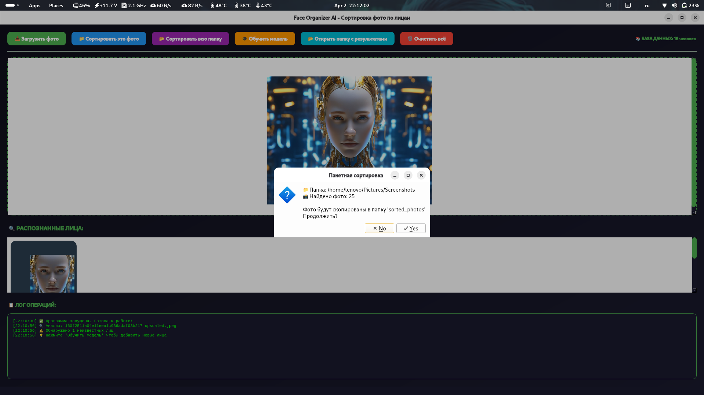
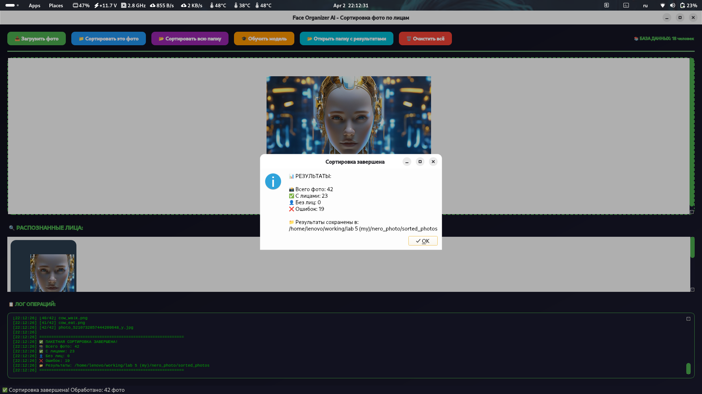

<div align="center">
  
# 🖼️ Face Organizer AI v1.2.0


> 🧠 Автоматическая сортировка фотографий по лицам с дообучением  
> 📁 Умное распознавание • Маркировка ошибок • Пакетная обработка

</div>

---

## 📋 Оглавление
- [📖 О проекте](#-о-проекте)
- [✨ Возможности](#-возможности)
- [📸 Демонстрация](#-демонстрация)
- [📥 Установка и запуск](#-установка-и-запуск)
- [🎮 Использование](#-использование)
- [🛠 Технологии](#-технологии)
- [🧠 Архитектура распознавания](#-архитектура-распознавания)
- [🔧 Решение проблем](#-решение-проблем)
- [📄 Лицензия](#-лицензия)
- [📬 Контакты](#-контакты-и-поддержка)

---

## 📖 О проекте

**Face Organizer AI** — это десктопное приложение для автоматической сортировки фотографий по людям на основе распознавания лиц. Вместо ручного разбора тысяч фото программа сама определяет, кто изображен на снимке, и раскладывает их по папкам с именами.

### Почему это лучше ручной сортировки?

| Ручная сортировка | Face Organizer AI |
|-------------------|-------------------|
| Часы ручного труда | Минуты автоматической обработки |
| Ошибки при похожих лицах | Точность >90% при хорошем освещении |
| Нужно помнить кто есть кто | Модель запоминает сама |
| Пересортировка при новых людях | Дообучение в 2 клика |
| Дубликаты занимают место | Защита от дубликатов по хешу |

---

## ✨ Возможности

| Фича | Описание |
|------|----------|
| 🎯 **Распознавание лиц** | FaceNet эмбеддинги + Haar Cascade детектор |
| 📚 **Дообучение модели** | Добавление новых людей через UI |
| ❌ **Маркировка ошибок** | Области, которые НЕ являются лицом, запоминаются |
| 📁 **Умная сортировка** | Автоматическое копирование в папки с именами |
| 📂 **Пакетная обработка** | Сортировка целых папок с прогресс-баром |
| 🔄 **Пересортировка** | Обновление старых фото после обучения |
| 🛡️ **Защита от дубликатов** | MD5 хеширование файлов |
| 🎨 **Современный UI** | Анимации, прогресс-бары, Drag-and-drop |
| 📊 **Детальное логирование** | Все операции в реальном времени |

---

## 📸 Демонстрация

<div align="center">

| 🖥️ Главное окно | 🎓 Обучение модели |
|:---------------:|:------------------:|
|  |  |

| 📁 Результат сортировки |
|:----------------------:|
|  |

</div>

---

## 📥 Установка и запуск

### ⚡ Быстрый старт

```bash
# 1. Клонируйте репозиторий
git clone https://github.com/yourusername/face_organizer.git
cd face_organizer

# 2. Создайте виртуальное окружение
python3.10 -m venv venv
source venv/bin/activate  # Linux/Mac
# или
venv\Scripts\activate     # Windows

# 3. Установите зависимости
pip install -r requirements.txt

# 4. Скачайте модели в папку models/
mkdir -p models
# Поместите файлы:
# - models/haarcascade_frontalface_default.xml
# - models/facenet.tflite

# 5. Запустите приложение
python main.py
```

### 📦 Требования
- Python 3.10 или выше
- 4+ ГБ ОЗУ (рекомендуется 8 ГБ)
- CPU с поддержкой AVX2 (для TensorFlow)
- Linux / Windows / macOS

### 🚀 После запуска

Откроется графическое окно приложения. Перетащите фото или нажмите "Загрузить фото".

---

## 🎮 Использование

### 👤 Основной workflow

| Шаг | Действие | Описание |
|-----|----------|----------|
| 1 | **Загрузить фото** | Перетащите или выберите файл |
| 2 | **Анализ** | Нейросеть находит и распознает лица |
| 3 | **Обучение** | Добавьте имена для неизвестных лиц |
| 4 | **Сортировка** | Фото копируются в папки с именами |
| 5 | **Пересортировка** | Обновите старые фото после обучения |

### 🔑 Кнопки интерфейса

| Кнопка | Действие |
|--------|----------|
| 📤 **Загрузить фото** | Анализ одного изображения |
| 📁 **Сортировать это фото** | Копирование в папку с именем |
| 📂 **Сортировать всю папку** | Пакетная обработка |
| 🎓 **Обучить модель** | Открыть панель добавления лиц |
| 🔄 **Пересортировать всё** | Обновить фото из unknown |
| ❌ **ЭТО НЕ ЛИЦО** | Пометить как ложное срабатывание |
| 📂 **Открыть папку** | Показать результаты |

### 📁 Структура выходных папок

```
sorted_photos/
├── Илья/              # Фото с Дмитрием
│   └── abc123.jpg
├── Иван/              # Фото с Андреем
│   └── def456.jpg
├── unknown/           # Неизвестные лица
│   └── ghi789.jpg
└── no_faces/          # Фото без лиц
    └── jkl012.jpg
```

---

## 🛠 Технологии

```
🐍 Python 3.10+       — основной язык
🎨 PyQt6              — GUI фреймворк
🧠 TensorFlow 2.13    — FaceNet модель
👁️ OpenCV 4.8         — детекция лиц
💾 SQLite3            — хранение эмбеддингов
🔐 hashlib            — MD5 для дубликатов
📝 logging            — подробное логирование
```

---

## 🧠 Архитектура распознавания

<div align="center">

```
┌─────────────────┐     ┌─────────────────┐     ┌─────────────────┐
│   Загрузка      │────▶│   Детекция      │────▶│   Извлечение    │
│   изображения   │     │   лиц (Haar)    │     │   эмбеддингов   │
└─────────────────┘     └─────────────────┘     └─────────────────┘
                                                          │
                                                          ▼
┌─────────────────┐     ┌─────────────────┐     ┌─────────────────┐
│   Сортировка    │◀────│   Сравнение     │◀────│   Поиск в       │
│   по папкам     │     │   (косинусное)  │     │   базе          │
└─────────────────┘     └─────────────────┘     └─────────────────┘
```

</div>

### 🔒 Безопасное хранение

```python
# В базе данных хранятся:
- Эмбеддинги лиц (128-мерные векторы)
- Имена людей
- Хеши файлов для защиты от дубликатов

# НЕ хранятся:
- Исходные изображения
- Пароли или личная информация
```

### 🛡️ Защита от проблем

| Проблема | Решение |
|----------|---------|
| 🔄 Дубликаты фото | MD5 хеширование |
| ❌ Ошибочное распознавание | Маркировка "НЕ ЛИЦО" |
| 👤 Новые люди | Дообучение через UI |
| 📁 Пересортировка | Автоматическое обновление |

---

## 🔧 Решение проблем

<details>
<summary>❌ Окно не отображается</summary>

```bash
# Проверьте DISPLAY переменную
echo $DISPLAY
export DISPLAY=:0

# Попробуйте другой бэкенд
QT_QPA_PLATFORM=xcb python main.py
```
</details>

<details>
<summary>❌ Ошибка импорта numpy</summary>

```bash
# Downgrade numpy до совместимой версии
pip uninstall numpy
pip install numpy==1.23.5
```
</details>

<details>
<summary>❌ Segmentation fault (segfault)</summary>

```bash
# Отключите GPU и уменьшите логи
export CUDA_VISIBLE_DEVICES=-1
export TF_CPP_MIN_LOG_LEVEL=2
python main.py
```
</details>

<details>
<summary>❌ Не распознаются лица</summary>

1. Убедитесь, что фото хорошего качества
2. Лицо должно быть видно анфас
3. Минимальный размер лица — 50x50 пикселей
4. Проверьте наличие моделей в папке `models/`
</details>

<details>
<summary>❌ Фото не сохраняются в sorted_photos</summary>

1. Нажмите кнопку **"Сортировать фото"** (анализ не сохраняет)
2. Проверьте права на запись в папке
3. Посмотрите лог на наличие ошибок
</details>

<details>
<summary>❌ Дублируются фото при пересортировке</summary>

1. Система автоматически проверяет дубликаты по MD5
2. Если дубликат найден — фото не копируется
3. В логе будет запись "duplicate"
</details>

---

## 🤝 Вклад в проект

Приветствуются PR и Issues! 🙌

1. Форкните репозиторий
2. Создайте ветку: `git checkout -b feature/your-feature`
3. Закоммитьте изменения: `git commit -m 'feat: add your feature'`
4. Отправьте: `git push origin feature/your-feature`
5. Откройте Pull Request

---

## 📄 Лицензия

<div align="center">

[](LICENSE)

Проект распространяется под лицензией **MIT**.  
См. файл [LICENSE](LICENSE) для подробностей.

</div>

---

<div align="center">

## 📬 Контакты и поддержка

> 💬 Есть вопрос, идея или нашли баг? Пишите!

[](https://github.com/yourusername)
[](https://t.me/username)
[](mailto:your.email@example.com)

</div>

---

**Face Organizer AI** — забудьте о ручной сортировке фото! 🖼️🤖

*Сделано с ❤️ для удобной организации фотографий*

</div>
